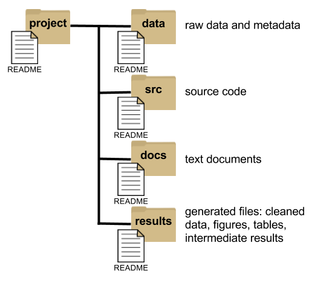
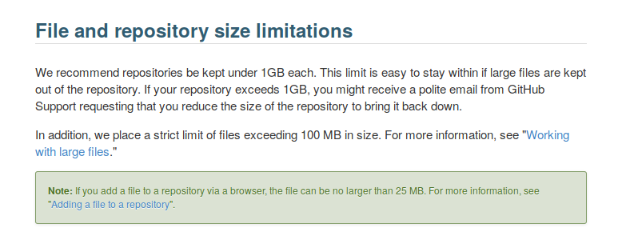
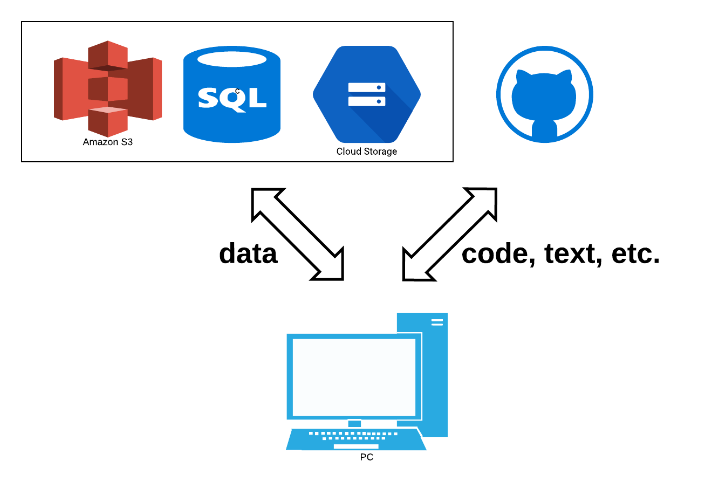

```{r setup, include=FALSE}
options(htmltools.dir.version = FALSE)

```

```{r libraries, include=FALSE, eval=FALSE}

library(tidyverse)
library(kableExtra)
```

class: inverse

<br>
<br>

“There are only two hard things in Computer Science: cache invalidation and naming things.”

— Phil Karlton


---

#### BP: naming things - principles for file (and other things) names

--

* machine readable

  - regular expression and globbing friendly
      + avoid spaces, punctuation, accented characters, case sensivity
  - easy to compute on with deliberate use of delimiters
      + example: *2017-11-17_berneilwash_oxygen_day_1.csv*

.footnote[J. Bryan [Naming things](https://speakerdeck.com/jennybc/how-to-name-files)]
  
--

* human readable

  - names contain info about the content
  - easy to figure out what what something is based on the name
      + *2016_salmon_counts.csv* conveys a lot of information about the object, and has far more meaning than *fishData.csv*
  
--

* play well with default ordering
.pull-left[

- 1_file_name.csv
- 11_file_name.csv
- 2_file_name.csv
]
.pull-right[

- 01_file_name.csv
- 02_file_name.csv
- 11_file_name.csv
]


---
class: inverse

#### BP: naming - names matter in times of stress

which set of file(names)s would you prefer at 3 a.m. before a dealine?

.center[
  
]

.footnote[J. Bryan [Naming things](https://speakerdeck.com/jennybc/how-to-name-files)]


---

#### BP: employ sound project organization

*your closest collaborator is you six months ago, but you do not reply to emails (K. Broman paraphrasing M. Holder)*

.pull-left[
  
]

.pull-right[
.small[
* segregate all materials for a project in one directory
* organize according to prevailing conventions (e.g., R package structure)
* maintain a clear separation of data, method, and output while unambiguously expressing the relationship among them
* specify the computational environment used for the original analysis
* organize such that another person can know what to expect from the plain meaning of the file and directory names
* include README files
]]

.footnote[K. Broman [Steps toward reproducible research](bit.ly/jsm2016)]


---

.center[
  
]

---

#### hybrid approach: data in the cloud

.center[
  
]


---

#### BP: keep the raw data raw

* save the raw data

.center[
  
]

.footnote[Wilson et al. (2017) [Good enough practices in scientific computing](https://doi.org/10.1371/journal.pcbi.1005510)]


